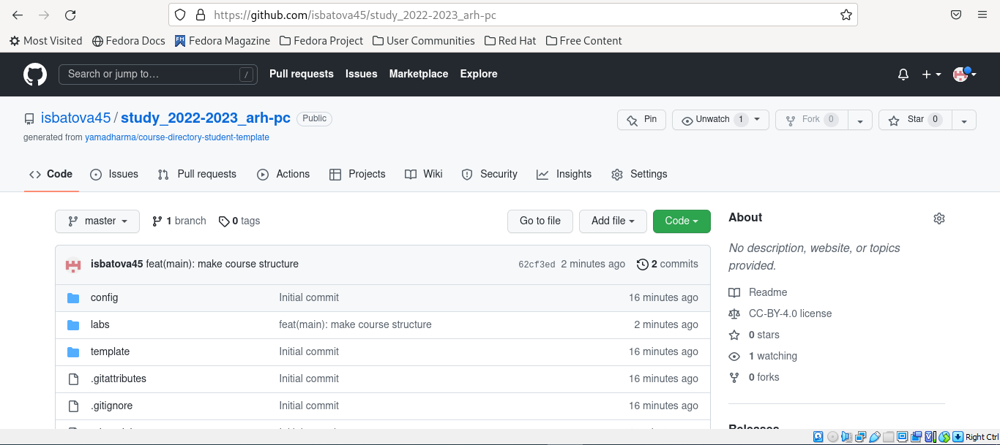

---
## Front matter
title: "Отчёт по лабораторной работе №3"
subtitle: "Дисциплина: Архитектура компьютера"
author: "Батова Ирина Сергеевна, НММбд-01-22"

## Generic otions
lang: ru-RU
toc-title: "Содержание"

## Bibliography
bibliography: bib/cite.bib
csl: pandoc/csl/gost-r-7-0-5-2008-numeric.csl

## Pdf output format
toc: true # Table of contents
toc-depth: 2
lof: true # List of figures
lot: true # List of tables
fontsize: 12pt
linestretch: 1.5
papersize: a4
documentclass: scrreprt
## I18n polyglossia
polyglossia-lang:
  name: russian
  options:
	- spelling=modern
	- babelshorthands=true
polyglossia-otherlangs:
  name: english
## I18n babel
babel-lang: russian
babel-otherlangs: english
## Fonts
mainfont: PT Serif
romanfont: PT Serif
sansfont: PT Sans
monofont: PT Mono
mainfontoptions: Ligatures=TeX
romanfontoptions: Ligatures=TeX
sansfontoptions: Ligatures=TeX,Scale=MatchLowercase
monofontoptions: Scale=MatchLowercase,Scale=0.9
## Biblatex
biblatex: true
biblio-style: "gost-numeric"
biblatexoptions:
  - parentracker=true
  - backend=biber
  - hyperref=auto
  - language=auto
  - autolang=other*
  - citestyle=gost-numeric
## Pandoc-crossref LaTeX customization
figureTitle: "Рис."
tableTitle: "Таблица"
listingTitle: "Листинг"
lofTitle: "Список иллюстраций"
lotTitle: "Список таблиц"
lolTitle: "Листинги"
## Misc options
indent: true
header-includes:
  - \usepackage{indentfirst}
  - \usepackage{float} # keep figures where there are in the text
  - \floatplacement{figure}{H} # keep figures where there are in the text
---

# Цель работы

Целью работы является изучить идеологию и применение средств контроля
версий. Приобрести практические навыки по работе с системой git.

# Выполнение лабораторной работы

Запускаем виртуальную машину. Для начала работы заходим на github.com и создаем учетную запись. После этого заходим в терминал. 
Первым делом нам нужно сделать предварительную конфигурацию git. Для этого последовательно вводим команды “git config --global user.name "Irina Batova"” и “git config --global user.email "1132226490@pfur.ru"” (рис. [-@fig:001]).

{ #fig:001 width=70% }

Далее настроим utf-8 в выводе сообщений git (команда “git config --global core.quotepath false”). Также зададим имя начальной ветки – master (команда “git config --global init.defaultBranch master”), параметр autocrlf (команда “git config --global core.autocrlf input”) и параметр safecrlf (команда “git config --global core.safecrlf warn”) (рис. [-@fig:002]).

{ #fig:002 width=70% }

Следующий шаг – генерация ключей (используется для идентификации пользователя на сервере репозиториев). Для этого используется команда “ssh-keygen -C” (рис. [-@fig:003]).

{ #fig:003 width=70% }

После этого нам необходимо загрузить этот ключ. Для этого заходим на сайт github.com, переходим в Setting – SSH and GPG keys – New SSH key (рис. [-@fig:004]).

{ #fig:004 width=70% }

Далее возвращаемся в терминал и вводим команду “cat ~/.ssh/id_rsa.pub | xclip -sel clip”, чтобы скопировать ключ. В процессе соглашаемся на установление пакета “xclip” (рис. [-@fig:005]).

{ #fig:005 width=70% }

После этого возвращаемся на github.com, вводим название ключа “Laptop_home” и в поле “Key” вставляем ключ (рис. [-@fig:006]). Ключ создан (рис. [-@fig:007]).

{ #fig:006 width=70% }

{ #fig:007 width=70% }

Возвращаемся в терминал. С помощью команды “mkdir –p” создаем каталог “Архитектура компьютера” (рис. [-@fig:008]).

{ #fig:008 width=70% }

Далее открываем браузер и переходим на страницу репозитория с шаблоном курса по ссылке https://github.com/yamadharma/course-directory-student-template. На открывшейся страницы нажимаем кнопку “Use this template” (рис. [-@fig:009]).

{ #fig:009 width=70% }

В открывшемся окне задаем имя репозитория “study_2022-2023_arh-pc”, остальные настройки оставляем без изменений. Для создания репозитория нажимаем внизу окна кнопку “Create repository from template” (рис. [-@fig:0010]).

{ #fig:0010 width=70% }

Возвращаемся в терминал и с помощью команды “cd” переходим в каталог “Архитектура компьютера” (рис. [-@fig:0011]).

{ #fig:0011 width=70% }

После этого возвращаемся в браузер, на страничке созданного репозитория выбираем Code – SSH и копируем ссылку для клонирования репозитория (рис. [-@fig:0012]). После этого возвращаемся в терминал и с помощью команды “ git clone –recursive” клонируем созданный репозиторий (рис. [-@fig:0013]).

{ #fig:0012 width=70% }

{ #fig:0013 width=70% }

После этого переходим в каталог курса “arch-pc” (используем команду “cd”), удаляем лишние файлы (команда “rm”) и создаем необходимые каталоги (рис. [-@fig:0014]).

{ #fig:0014 width=70% }

После этого, используя команды “git add”, “git commit –am” и “git push” отправляем файлы на сервер (рис. [-@fig:0015], рис. [-@fig:0016]).

{ #fig:0015 width=70% }

{ #fig:0016 width=70% }

Проверяем правильность создания всех каталогов на github (рис. [-@fig:0017]).

{ #fig:0017 width=70% }

# Выполнение заданий для самостоятельной работы

Переносим в соответствующие каталоги отчеты по первой и второй лабораторной работе (lab-lab01-report и lab-lab02-report соответственно). После этого с помощью последовательности команд загружаем файлы в github: “git add .”, “git commit –am 'add lab03'” и “git push” (рис. [-@fig:0018]). Проверяем, корректно ли все загрузилось (рис. [-@fig:0019]).

{ #fig:0018 width=70% }

{ #fig:0019 width=70% }

Также данный отчет переносим в lab-lab03-report. После этого загружаем в github с помощью аналогичной последовательности команд.

# Выводы

В ходе данной лабораторной работы мной были изучены идеология и применение средств контроля версий, а также приобретены практические навыки по работе с системой git.

