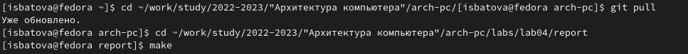
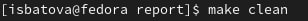
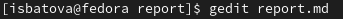

---
## Front matter
title: "Отчет по лабораторной работе №4"
subtitle: "Дисциплина: Архитектура Компьютера"
author: "Батова Ирина Сергеевна НММбд-01-22"

## Generic otions
lang: ru-RU
toc-title: "Содержание"

## Bibliography
bibliography: bib/cite.bib
csl: pandoc/csl/gost-r-7-0-5-2008-numeric.csl

## Pdf output format
toc: true # Table of contents
toc-depth: 2
lof: true # List of figures
lot: true # List of tables
fontsize: 12pt
linestretch: 1.5
papersize: a4
documentclass: scrreprt
## I18n polyglossia
polyglossia-lang:
  name: russian
  options:
	- spelling=modern
	- babelshorthands=true
polyglossia-otherlangs:
  name: english
## I18n babel
babel-lang: russian
babel-otherlangs: english
## Fonts
mainfont: PT Serif
romanfont: PT Serif
sansfont: PT Sans
monofont: PT Mono
mainfontoptions: Ligatures=TeX
romanfontoptions: Ligatures=TeX
sansfontoptions: Ligatures=TeX,Scale=MatchLowercase
monofontoptions: Scale=MatchLowercase,Scale=0.9
## Biblatex
biblatex: true
biblio-style: "gost-numeric"
biblatexoptions:
  - parentracker=true
  - backend=biber
  - hyperref=auto
  - language=auto
  - autolang=other*
  - citestyle=gost-numeric
## Pandoc-crossref LaTeX customization
figureTitle: "Рис."
tableTitle: "Таблица"
listingTitle: "Листинг"
lofTitle: "Список иллюстраций"
lotTitle: "Список таблиц"
lolTitle: "Листинги"
## Misc options
indent: true
header-includes:
  - \usepackage{indentfirst}
  - \usepackage{float} # keep figures where there are in the text
  - \floatplacement{figure}{H} # keep figures where there are in the text
---

# Цель работы

Целью работы является освоение процедуры оформления отчетов с помощью
легковесного языка разметки Markdown.

# Выполнение лабораторной работы

Открываем терминал и переходим в каталог курса курса с помощью команды cd, обновляем локальный репозиторий с помощью команды git pull и переходим в каталог labs/lab04/report. Вводим команду make для компиляции шаблона (рис. [-@fig:001])

{ #fig:001 width=70% }

После этого проверяем, сгенерировались ли у нас файлы report.docx и report.pdf. 

Далее вводим команду make clean для удаления полученных файлов (рис. [-@fig:002]

{ #fig:002 width=70% }

После этого открываем файл report.md в текстовом редакторе gedit с помощью команды gedit report.md и заполняем данный отчет (рис. [-@fig:003]).

{ #fig:003 width=70% }

Далее возвращаемся в терминал и вводим команду make для компиляции файла report.md в pdf и docx.

После заполнения отчета загружаем файлы на github.

# Выполнение заданий для самостоятельной работы

Переходим в каталог lab03/report с помощью команды cd.

Открываем файл report.md в текстовом редакторе gedit и создаем отчет по лабораторной работе №3 в формате Markdown.

Загружаем файлы на github.

# Выводы 

В данной лабораторной работе были освоены процедуры оформления отчетов с помощью языка разметки Markdown.

