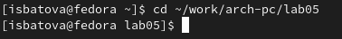
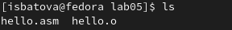

---
## Front matter
title: "Отчёт по лабораторной работе №5"
subtitle: "Архитектура компьютера"
author: "Батова Ирина Сергеевна НММбд-01-22"

## Generic otions
lang: ru-RU
toc-title: "Содержание"

## Bibliography
bibliography: bib/cite.bib
csl: pandoc/csl/gost-r-7-0-5-2008-numeric.csl

## Pdf output format
toc: true # Table of contents
toc-depth: 2
lof: true # List of figures
lot: true # List of tables
fontsize: 12pt
linestretch: 1.5
papersize: a4
documentclass: scrreprt
## I18n polyglossia
polyglossia-lang:
  name: russian
  options:
	- spelling=modern
	- babelshorthands=true
polyglossia-otherlangs:
  name: english
## I18n babel
babel-lang: russian
babel-otherlangs: english
## Fonts
mainfont: PT Serif
romanfont: PT Serif
sansfont: PT Sans
monofont: PT Mono
mainfontoptions: Ligatures=TeX
romanfontoptions: Ligatures=TeX
sansfontoptions: Ligatures=TeX,Scale=MatchLowercase
monofontoptions: Scale=MatchLowercase,Scale=0.9
## Biblatex
biblatex: true
biblio-style: "gost-numeric"
biblatexoptions:
  - parentracker=true
  - backend=biber
  - hyperref=auto
  - language=auto
  - autolang=other*
  - citestyle=gost-numeric
## Pandoc-crossref LaTeX customization
figureTitle: "Рис."
tableTitle: "Таблица"
listingTitle: "Листинг"
lofTitle: "Список иллюстраций"
lotTitle: "Список таблиц"
lolTitle: "Листинги"
## Misc options
indent: true
header-includes:
  - \usepackage{indentfirst}
  - \usepackage{float} # keep figures where there are in the text
  - \floatplacement{figure}{H} # keep figures where there are in the text
---

# Цель работы

Освоение процедуры компиляции и сборки программ, написанных на ассемблере NASM.

# Выполнение лабораторной работы

Первым делом мы создаем подкаталог "arch-pc" в каталоге "work" с помощью команды 'mkdir -p' (рис. [-@fig:001]).

{ #fig:001 width=70% }

Далее переходим в этот каталог с помощью команды 'cd' (рис. [-@fig:002]).

{ #fig:002 width=70% }

После этого с помощью команды 'touch' создаем файл "hello.asm" и открываем его в текстовом редакторе командой 'gedit' (рис. [-@fig:003]).

{ #fig:003 width=70% }

В открытый файл вводим программу "Hello, world!" (рис. [-@fig:004]).

{ #fig:004 width=70% }

Далее нам необходимо превратить текст команды в объектный код. Для этого используем команду 'nasm -f elf hello.asm' (рис. [-@fig:005]).

{ #fig:005 width=70% }

После предыдущей команды должен был создаться объектный файл с именем "hello.o", проверяем это командой 'ls' (рис. [-@fig:006]).

{ #fig:006 width=70% }

Далее запускаем команду 'nasm -o obj.o -f elf -g -l list.lst hello.asm' (рис. [-@fig:007]). Эта команда комплириует файл "hello.asm" в объектный файл с именем "obj.o", а также создается файл листинга "list.lst". После этого проверяем корректность создания файлов командой 'ls' (рис. [-@fig:008]).

{ #fig:007 width=70% }

{ #fig:008 width=70% }

После этого нам нужно получить исполняемую программу. Для этого вводим команду 'ld -m elf_i386 hello.o -o hello' (рис. [-@fig:009]). У нас должен был создаться файл "hello", проверям это командой 'ls' (рис. [-@fig:0010]).

{ #fig:009 width=70% }

{ #fig:0010 width=70% }

Далее вводим команду 'ld -m elf_i386 obj.o -o main' (рис. [-@fig:0011]). Эта команда создает исполняемый файл с именем "main", который собран из объектного файла с именем "obj.o".

{ #fig:0011 width=70% }

Далее запускаем исполняемый файл "hello" (рис. [-@fig:0012]). Видим, что программа выполняется корректно и выводит "Hello, world!".

{ #fig:0012 width=70% }

# Задание для самостоятельной работы

1. В каталоге "~/work/arch-pc/lab05" копируем файл "hello.asm" с именем "lab5.asm". Для этого используем команду 'cp' (рис. [-@fig:0013]).

{ #fig:0013 width=70% }

2. Открываем файл "lab5.asm" в текстовом редакторе (рис. [-@fig:0014]) и во второй строке вместо "Hello, world!" вводим "Irina Batova" (рис. [-@fig:0015]).

{ #fig:0014 width=70% }

{ #fig:0015 width=70% }

3. Далее нужно получить объектный файл. Для этого вводим команду 'nasm -f elf lab5.asm' и на всякий случай проверяем корректность выполненной команды (рис. [-@fig:0016]). 

{ #fig:0016 width=70% }

После этого выполняем компоновку исполняемого файла. Для этого вводим команду 'ld -m elf_i386 lab5.o -o lab5' и на всякий случай проверяем корректность выполненной команды (рис. [-@fig:0017]). 

{ #fig:0017 width=70% }

Запускаем получившийся исполяемый файл (рис. [-@fig:0018]). 

{ #fig:0018 width=70% }

4. Копируем  файлы hello.asm и lab5.asm в локальный репозиторий в каталог lab05 (рис. [-@fig:0019]) и загружаем файлы на Github.

{ #fig:0019 width=70% }

# Выводы

В данной лабораторной работе были освоение процедуры компиляции и сборки программ, написанных на ассемблере NASM.

