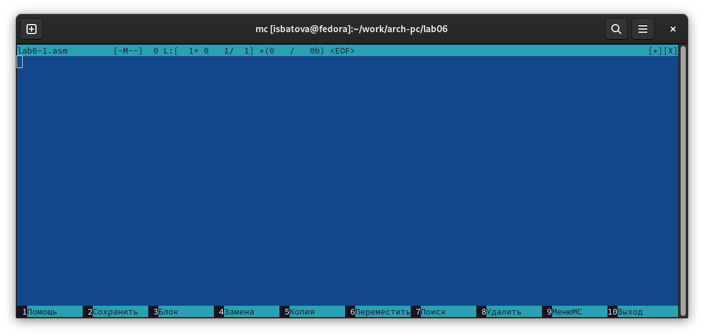
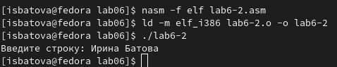
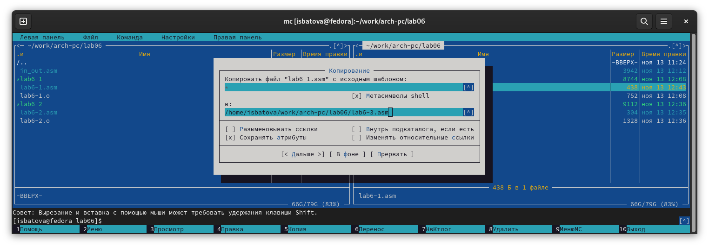

---
## Front matter
title: "Отчёт по лабораторной работе №6"
subtitle: "Дисциплина: Архитектура компьютера"
author: "Батова Ирина Сергеевна, НММбд-01-22"

## Generic otions
lang: ru-RU
toc-title: "Содержание"

## Bibliography
bibliography: bib/cite.bib
csl: pandoc/csl/gost-r-7-0-5-2008-numeric.csl

## Pdf output format
toc: true # Table of contents
toc-depth: 2
lof: true # List of figures
lot: true # List of tables
fontsize: 12pt
linestretch: 1.5
papersize: a4
documentclass: scrreprt
## I18n polyglossia
polyglossia-lang:
  name: russian
  options:
	- spelling=modern
	- babelshorthands=true
polyglossia-otherlangs:
  name: english
## I18n babel
babel-lang: russian
babel-otherlangs: english
## Fonts
mainfont: PT Serif
romanfont: PT Serif
sansfont: PT Sans
monofont: PT Mono
mainfontoptions: Ligatures=TeX
romanfontoptions: Ligatures=TeX
sansfontoptions: Ligatures=TeX,Scale=MatchLowercase
monofontoptions: Scale=MatchLowercase,Scale=0.9
## Biblatex
biblatex: true
biblio-style: "gost-numeric"
biblatexoptions:
  - parentracker=true
  - backend=biber
  - hyperref=auto
  - language=auto
  - autolang=other*
  - citestyle=gost-numeric
## Pandoc-crossref LaTeX customization
figureTitle: "Рис."
tableTitle: "Таблица"
listingTitle: "Листинг"
lofTitle: "Список иллюстраций"
lotTitle: "Список таблиц"
lolTitle: "Листинги"
## Misc options
indent: true
header-includes:
  - \usepackage{indentfirst}
  - \usepackage{float} # keep figures where there are in the text
  - \floatplacement{figure}{H} # keep figures where there are in the text
---

# Цель работы

Приобретение практических навыков работы в Midnight Commander. Освоение
инструкций языка ассемблера mov и int.

# Выполнение лабораторной работы

1. Вводим команду 'mc' в терминале и открываем Midnight Commander (рис. [-@fig:001]).

{ #fig:001 width=70% }

2. Переходим в каталог arch-pc, который был создан при выполнении пятой лабораторной работы (рис. [-@fig:002]).

{ #fig:002 width=70% }

3. Нажимаем клавишу F7 и создаем каталог с именем lab06 (рис. [-@fig:003]).

{ #fig:003 width=70% }

4. С помощью команды 'touch' создаем в этом каталоге файл 'lab6-1.asm' (рис. [-@fig:004]).

{ #fig:004 width=70% }

5. Нажимаем команду F4 и открываем файл 'lab6-1.asm' (рис. [-@fig:005]).

{ #fig:005 width=70% }

6. Вводим в файл программу. Листинг программы берем из лабораторной работы (рис. [-@fig:006]).

{ #fig:006 width=70% }

Далее нажимаем F2 для сохранения файла и F10 для выхода из редактора.

7. Нажимаем клавишу F3 и проверяем, что в файле содержится текст программы.

8. Закрываем Midnight Commander. Далее нужно сделать из 'lab6-1.asm' объектный файл (команда 'nasm'), выполнить его компоновку (команда 'ld') и запустить получившийся исполнительный файл (команда './lab6-1'). Программа работает корректно: выводит строку "Введите строку", на запрос вводим имя и фамилию (рис. [-@fig:007]).

{ #fig:007 width=70% }

9. Заходим в ТУИС и скачиваем файл 'in_out.asm', используемый для упрощения написания программ (рис. [-@fig:008]).

{ #fig:008 width=70% }

10. Для корректной работы этот подключаемый файл должен лежать в одном каталоге с файлом с программы. Открываем mс и на одной панели открываем каталог lab06 (где лежит файл 'lab6-1.asm'), а на другой панели открываем каталог загрузок (где лежит файл 'in_out.asm'). Далее нажимаем клавишу F5 и копируем наш внешний файл в каталог 'lab06' (рис. [-@fig:009]).

{ #fig:009 width=70% }

11. Далее выделяем файл 'lab6-1.asm', нажимаем клавишу F6 и копируем этот файл с именем 'lab6-2.asm' (рис. [-@fig:0010]).

{ #fig:0010 width=70% }

12. Открываем файл 'lab6-2.asm'. В начале вводим '%include 'in_out.asm'' (подключаем внешний файл). Далее также заменяем подпрограммами из файла печать сообщения, ввод сообщения и завершение (рис. [-@fig:0011]).

{ #fig:0011 width=70% }

Далее сохраняем файл и выходим из Midnight Commander. Вводим поочередно команды 'nasm', 'ld' и './lab6-1' (оттранслировать программу в объектный файл, выполнить компоновку исполняемого файла и запустить его). Видим, что программа работает корректно (рис. [-@fig:0012]).

{ #fig:0012 width=70% }

13. Открываем файл 'lab6-2.asm' и заменяем подпрограмму 'sprintLF' на 'sprint' (рис. [-@fig:0013]).

{ #fig:0013 width=70% }

Создаем исполняемый файл и запускаем его с помощью последовательности команд, описанных выше (рис. [-@fig:0014]).

{ #fig:0014 width=70% }

Разница между 'sprint' и 'sprintLF' в том, что первая просто выводит сообщение на экран, а вторая добавляет к выводу сообщения переход на новую строку.

# Задание для самостоятельной работы

1. Открываем Midnight Commander, выделяем файл 'lab6-1.asm' и копируем его с именем 'lab6-3.asm' (рис. [-@fig:0015]).

{ #fig:0015 width=70% }

Нам необходимо внести изменения в программу так, чтобы помимо вывода приглашения "Введите строку:" и возможности ввести строку с клавиатуры, она выводила введенную строку на экран. Для этого в тексте программы перед командой завершения вводим:

mov eax, 4
mov ebx, 1 
mov ecx, buf1
int 80h 

Далее сохраняем и закрываем файл (рис. [-@fig:0016]).

{ #fig:0016 width=70% }

Выполняем создание исполняемого файла и запускаем его (рис. [-@fig:0017]). На приглашение вводим фамилию - команда выводит нашу фамилию еще раз. Значит, программа написана корректно.

{ #fig:0017 width=70% }

2. Далее нам необходимо изменить программу из файла 'lab6-2.asm' так, чтобы она работала аналогично программы из первого пункта. Для начала открываем Midnight Commander и копируем файл 'lab6-2.asm' с именем 'lab6-4.asm' (рис. [-@fig:0018]).

{ #fig:0018 width=70% }

Открываем файл. Изменяем его аналогично первому, но тут нам необходимо использовать внешний файл с подпрограммами. Поэтому в тексте программы перед командой завершения вводим:

mov eax, buf1
call sprint

Далее сохраняем и закрываем файл (рис. [-@fig:0019]).

{ #fig:0019 width=70% }

После этого создаем исполняемый файл и запускаем его (рис. [-@fig:0020]). Видим, что программа работает корректно.

{ #fig:0020 width=70% }

# Выводы

В данной лабораторной работе мной были приобретены практические навыки работы в Midnight Commander, а также освоены
инструкций языка ассемблера mov и int.
