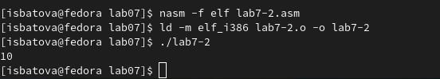
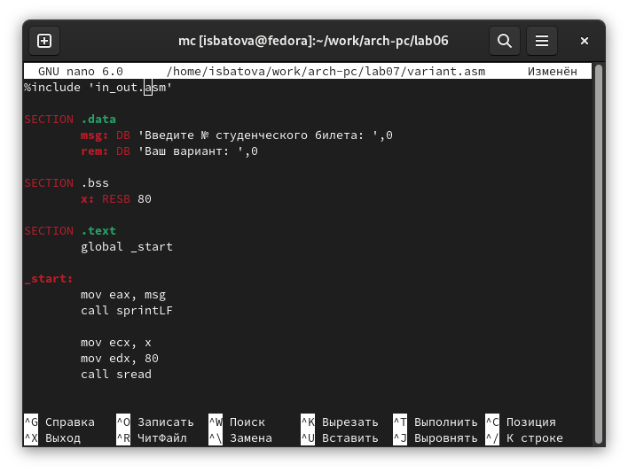

---
## Front matter
title: "Отчёт по лабораторной работе №7"
subtitle: "Дисциплина: Архитектура компьютера"
author: "Батова Ирина Сергеевна, НММбд-01-22"

## Generic otions
lang: ru-RU
toc-title: "Содержание"

## Bibliography
bibliography: bib/cite.bib
csl: pandoc/csl/gost-r-7-0-5-2008-numeric.csl

## Pdf output format
toc: true # Table of contents
toc-depth: 2
lof: true # List of figures
lot: true # List of tables
fontsize: 12pt
linestretch: 1.5
papersize: a4
documentclass: scrreprt
## I18n polyglossia
polyglossia-lang:
  name: russian
  options:
	- spelling=modern
	- babelshorthands=true
polyglossia-otherlangs:
  name: english
## I18n babel
babel-lang: russian
babel-otherlangs: english
## Fonts
mainfont: PT Serif
romanfont: PT Serif
sansfont: PT Sans
monofont: PT Mono
mainfontoptions: Ligatures=TeX
romanfontoptions: Ligatures=TeX
sansfontoptions: Ligatures=TeX,Scale=MatchLowercase
monofontoptions: Scale=MatchLowercase,Scale=0.9
## Biblatex
biblatex: true
biblio-style: "gost-numeric"
biblatexoptions:
  - parentracker=true
  - backend=biber
  - hyperref=auto
  - language=auto
  - autolang=other*
  - citestyle=gost-numeric
## Pandoc-crossref LaTeX customization
figureTitle: "Рис."
tableTitle: "Таблица"
listingTitle: "Листинг"
lofTitle: "Список иллюстраций"
lotTitle: "Список таблиц"
lolTitle: "Листинги"
## Misc options
indent: true
header-includes:
  - \usepackage{indentfirst}
  - \usepackage{float} # keep figures where there are in the text
  - \floatplacement{figure}{H} # keep figures where there are in the text
---

# Цель работы

Освоение арифметических инструкций языка ассемблера NASM.

# Выполнение лабораторной работы

1. Сначала создаем каталог для программ данной лабораторной работы, используя команду 'mkdir'. Далее переходим в этот каталог с помощью команды 'cd' и создаем файл 'lab7-1.asm' (рис. [-@fig:001]).

{ #fig:001 width=70% }

2. Открываем файл 'lab7-1.asm' и вводим в него программу из листинга 7.1 из лабораторной работы (рис. [-@fig:002]).

{ #fig:002 width=70% }

Перед запуском файла копируем файл 'in_out.asm' из каталога lab06 в каталог lab07 для корректной работы программы.

После этого создаем исполняемый файл и запускаем его (рис. [-@fig:003]). Наша программа выводит 'j' - это происходит потому, что программа складывает код символа '6' и код символа '4', и выводит символ, соответствующий сумме этих кодов.

{ #fig:003 width=70% }

3. Открываем файл 'lab7-1.asm' и немного видоизменяем программу: вместо символов '6' и '4' записываем числа 6 и 4 соответственно (рис. [-@fig:004]).

{ #fig:004 width=70% }

Создаем исполняемый файл и запускаем его (рис. [-@fig:005]). В данном случае у нас будет выводится символ с кодом 10. По таблице определяем, что это символ перевода строки, поэтому программа ничего не выводит, а только переходит на следующую строку.

{ #fig:005 width=70% }

4. В том же каталоге создаем файл 'lab7-2.asm', используя команду 'touch' (рис. [-@fig:006]).

{ #fig:006 width=70% }

Далее открываем этот файл и вводим в него программу из листинга 7.2 из лабораторной работы (рис. [-@fig:007]).

{ #fig:007 width=70% }

Создаем исполняемый файл и запускаем его (рис. [-@fig:008]). Программа выводит нам число 106, так как аналогично складываются коды символов '6' и '4', но благодаря функции iprintLF выводится само число (а не символ, которому соответствует данное число). 

{ #fig:008 width=70% }

5. Далее открываем файл 'lab7-2.asm' и видоизменяем его также, как изменяли первый файл: вместо символов '6' и '4' записываем числа 6 и 4 соответственно (рис. [-@fig:009]).

{ #fig:009 width=70% }

Создаем исполняемый файл и запускаем его (рис. [-@fig:0010]). Наша программа выводит '10'.

{ #fig:0010 width=70% }

Далее вновь открываем файл и вносим изменения - вместо iprintLF вводим iprint (рис. [-@fig:0011]).

{ #fig:0011 width=70% }

Вновь создаем исполняемый файл и запускаем его (рис. [-@fig:0012]). Наша программа также выводит '10', но, в отличии от использования 'iprintLF', 'iprint' не делает переход на новую строку.

{ #fig:0012 width=70% }

6. С помощью команды 'touch' в каталоге lab07 создаем файл 'lab7-3.asm' (рис. [-@fig:0013]).

{ #fig:0013 width=70% }

Открываем его и вводим программу из листинга 7.3 из лабораторной работы (рис. [-@fig:0014]).

{ #fig:0014 width=70% }

Создаем исполняемый файл и запускаем его (рис. [-@fig:0015]). Видим, что программа работает корректно.

{ #fig:0015 width=70% }

Далее вновь открываем этот файл и вносим изменения так, чтобы у нас вычислялось выражение f(x)=(4*6+2)/5 (рис. [-@fig:0016]).

{ #fig:0016 width=70% }

Создаем исполняемый файл и запускаем его (рис. [-@fig:0017]). Программа работает корректно: действительно, если мы устно посчитаем уравнение, то получим 5 с остатком 1.

{ #fig:0017 width=70% }

7. В каталоге lab07 создаем файл 'variant.asm', используя команду 'touch' (рис. [-@fig:0018]).

{ #fig:0018 width=70% }

Открываем данный файл, вводим в него программу из листинга 7.4 (рис. [-@fig:0019]).

{ #fig:0019 width=70% }

Создаем исполняемый файл и запускаем его (рис. [-@fig:0020]). На предложение ввести номер студенческого билета вводим его и получаем свой вариант. Проверяем аналитически - вариант выведен верно.

{ #fig:0020 width=70% }

# Ответы на вопросы

1. Какие строки листинга 7.4 отвечают за вывод на экран сообщения ‘Ваш
вариант:’?

За это отвечают строки:

mov eax,rem
call sprint

2. Для чего используется следующие инструкции? nasm mov ecx, x mov edx, 80 call sread

Данные инструкции используются для ввода сообщения (в данном случае х) и запись введенных данных в 'ecx'.

3. Для чего используется инструкция “call atoi”?

Данная инструкция используется для преобразования символьного вида в число.

4. Какие строки листинга 7.4 отвечают за вычисления варианта?

За вычисление варианта отвечают строки: 

mov ebx,20
div ebx
inc edx

5. В какой регистр записывается остаток от деления при выполнении инструкции “div ebx”?

Остаток от деления записывается в регистр 'edx'.

6. Для чего используется инструкция “inc edx”?

Эта инструкция используется для прибавления к значению регистра edx единицу.

7. Какие строки листинга 7.4 отвечают за вывод на экран результата вычислений?

За вывод на экран результату вычислений отвечают строки:

mov eax,edx
call iprintLF

# Задание для самостоятельной работы

Создаем файл с именем 'sam.asm'. В последнем пункте лабораторной работы мне был выдан 11 вариант, поэтому программа была написана для функции f(x)=10(x+1)-10 (рис. [-@fig:0021]).

{ #fig:0021 width=70% }

Создаем исполняемый файл и запускаем его (рис. [-@fig:0022]). На предложение ввести значение х вводим значения из таблицы: сначала 1, потом 7. При подсчете аналитически получаются такие же ответы, поэтому программа написана правильно.

{ #fig:0022 width=70% }

# Выводы

В данной лабораторной работе мной были освоены арифметические инструкции языка ассемблера NASM.

