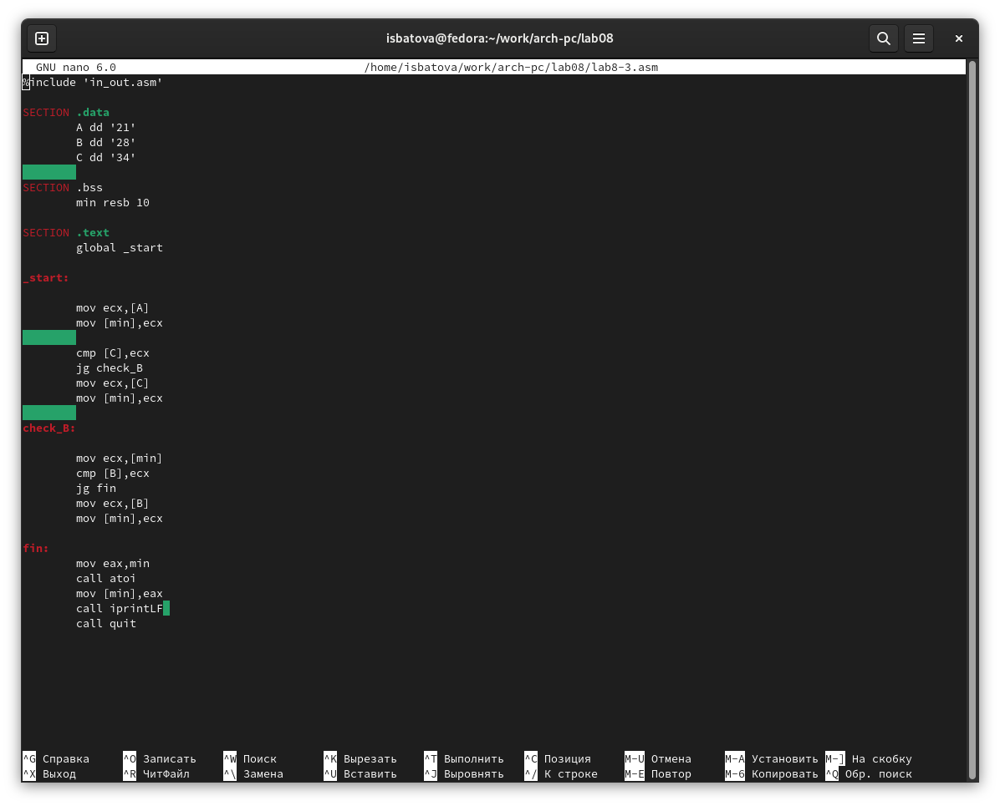

---
## Front matter
title: "Отчёт по лабораторной работе №8"
subtitle: "Дисциплина: Архитектура компьютера"
author: "Батова Ирина Сергеевна, НММбд-01-22"

## Generic otions
lang: ru-RU
toc-title: "Содержание"

## Bibliography
bibliography: bib/cite.bib
csl: pandoc/csl/gost-r-7-0-5-2008-numeric.csl

## Pdf output format
toc: true # Table of contents
toc-depth: 2
lof: true # List of figures
lot: true # List of tables
fontsize: 12pt
linestretch: 1.5
papersize: a4
documentclass: scrreprt
## I18n polyglossia
polyglossia-lang:
  name: russian
  options:
	- spelling=modern
	- babelshorthands=true
polyglossia-otherlangs:
  name: english
## I18n babel
babel-lang: russian
babel-otherlangs: english
## Fonts
mainfont: PT Serif
romanfont: PT Serif
sansfont: PT Sans
monofont: PT Mono
mainfontoptions: Ligatures=TeX
romanfontoptions: Ligatures=TeX
sansfontoptions: Ligatures=TeX,Scale=MatchLowercase
monofontoptions: Scale=MatchLowercase,Scale=0.9
## Biblatex
biblatex: true
biblio-style: "gost-numeric"
biblatexoptions:
  - parentracker=true
  - backend=biber
  - hyperref=auto
  - language=auto
  - autolang=other*
  - citestyle=gost-numeric
## Pandoc-crossref LaTeX customization
figureTitle: "Рис."
tableTitle: "Таблица"
listingTitle: "Листинг"
lofTitle: "Список иллюстраций"
lotTitle: "Список таблиц"
lolTitle: "Листинги"
## Misc options
indent: true
header-includes:
  - \usepackage{indentfirst}
  - \usepackage{float} # keep figures where there are in the text
  - \floatplacement{figure}{H} # keep figures where there are in the text
---

# Цель работы

Изучение команд условного и безусловного переходов. Приобретение навыков написания программ с использованием переходов. Знакомство с назначением и структурой файла листинга.

# Выполнение лабораторной работы

1. Создаем каталог 'lab08' с помощью команды mkdir, переходим в него с помощью команды cd и создаем в нем файл 'lab8-1.asm' с помощью команды touch (рис. [-@fig:001]).

{ #fig:001 width=70% }

2. Открываем файл 'lab8-1.asm' и вводим листинг 8.1 из лабораторной работы (рис. [-@fig:002]).

{ #fig:002 width=70% }

Создаем исполняемый файл и запускаем его (рис. [-@fig:003]). Программа выводит правильный результат, значит, она написана корректно.

{ #fig:003 width=70% }

Далее вновь открываем файл 'lab8-1.asm' и редактируем его так, чтобы она выводила сначала 'Сообщение №2', а потом 'Сообщение №1' (рис. [-@fig:004]).

{ #fig:004 width=70% }

Создаем исполняемый файл и запускаем его (рис. [-@fig:005]). Программа выводит правильный результат, значит, она написана корректно.

{ #fig:005 width=70% }

Далее редактируем файл 'lab8-1.asm' так, чтобы сообщения выводились в обратной последовательности: 'Сообщение №3', 'Сообщение №2', 'Сообщение №1' (рис. [-@fig:006]).

{ #fig:006 width=70% }

Создаем исполняемый файл и запускаем его (рис. [-@fig:007]). Программа выводит правильный результат, значит, она написана корректно.

{ #fig:007 width=70% } 

3. Создаем файл 'lab8-2.asm' с помощью команды 'touch' (рис. [-@fig:008]).

{ #fig:008 width=70% }

Открываем файл 'lab8-2.asm' и вводим листинг 8.3 из лабораторной работы (рис. [-@fig:009]).

{ #fig:009 width=70% }

Создаем исполняемый файл и запускаем его (рис. [-@fig:0010]). Проверяем работу программы, вводя несколько чисел - программа выводит правильный результат, значит, она написана корректно.

{ #fig:0010 width=70% }

4. Далее нам нужно получить файл листинга. Для этого вводим команду 'nasm -f elf -l lab8-2.lst lab8-2.asm' (рис. [-@fig:0011]). Далее открываем файл листинга с помощью редактора mcedit (рис. [-@fig:0012]).

{ #fig:0011 width=70% }

{ #fig:0012 width=70% }

Рассмотрим строки 20, 21, 22.

  1. 20, 21, 22 - номер строки.
  2. 000000F2, 000000F7, 000000FC - это адрес строки.
  3. B9[0A000000], BA0A000000, E842FFFFFF - это машинный код.
  4. 'mov ecx,B', 'call atoi', mov [B], eax - это исходный текст программы.

Далее открываем файл 'lab8-2.asm' и убираем у команды 'cmp' второй операнд (рис. [-@fig:0013]).

{ #fig:0013 width=70% }

Выполняем трансляцию с получением файла листинга (рис. [-@fig:0014]). Программа выводит ошибку, при этом файл листинга создается. Если открыть его, мы увидим, что в файле листинга также обозначена ошибка отсутствия одного операнда (рис. [-@fig:0015]).

{ #fig:0014 width=70% }

{ #fig:0015 width=70% }

# Задание для самостоятельной работы

1. Мой номер варианта 11 - поэтому значения a, b и с для первого задания, согласно таблице, 21, 28 и 34. Значит, программа должна выводить число 21 (наименьшее).

Создаем файл 'lab8-3.asm' и пишем в нем программу для вывода наименьшего числа (рис. [-@fig:0016]).

{ #fig:0016 width=70% }

Создаем исполняемый файл и запускаем его (рис. [-@fig:0017]). Программа выводит правильный результат, значит, она написана корректно.

{ #fig:0017 width=70% }

2. Для второго задания используем функцию 

- 4a, x = 0
- 4a + x, x ≠ 0

Создаем файл 'lab8-4.asm' и вводим в него программу (рис. [-@fig:0018]), (рис. [-@fig:0019]).

{ #fig:0018 width=70% }

{ #fig:0019 width=70% }

Создаем исполняемый файл и запускаем его (рис. [-@fig:0020]). Вводим пары чисел соответственно данным в таблице в лабораторной работы - 0,3 и 1,2. Если проверить аналитически, получаются такие же ответы, значит, программа написана корректно.

{ #fig:0020 width=70% }

# Выводы

В данной лабораторной работе мной были изучены команды условного и безусловного переходов, а также приобретены навыки написания программ с использованием переходов. Помимо этого, я узнала о назначении и структуре файла листинга.

