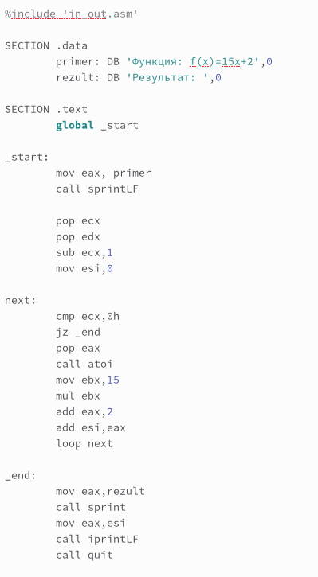

---
## Front matter
title: "Отчёт по лабораторной работе №9"
subtitle: "Дисциплина: Архитектура компьютера"
author: "Батова Ирина Сергеевна, НММбд-01-22"

## Generic otions
lang: ru-RU
toc-title: "Содержание"

## Bibliography
bibliography: bib/cite.bib
csl: pandoc/csl/gost-r-7-0-5-2008-numeric.csl

## Pdf output format
toc: true # Table of contents
toc-depth: 2
lof: true # List of figures
lot: true # List of tables
fontsize: 12pt
linestretch: 1.5
papersize: a4
documentclass: scrreprt
## I18n polyglossia
polyglossia-lang:
  name: russian
  options:
	- spelling=modern
	- babelshorthands=true
polyglossia-otherlangs:
  name: english
## I18n babel
babel-lang: russian
babel-otherlangs: english
## Fonts
mainfont: PT Serif
romanfont: PT Serif
sansfont: PT Sans
monofont: PT Mono
mainfontoptions: Ligatures=TeX
romanfontoptions: Ligatures=TeX
sansfontoptions: Ligatures=TeX,Scale=MatchLowercase
monofontoptions: Scale=MatchLowercase,Scale=0.9
## Biblatex
biblatex: true
biblio-style: "gost-numeric"
biblatexoptions:
  - parentracker=true
  - backend=biber
  - hyperref=auto
  - language=auto
  - autolang=other*
  - citestyle=gost-numeric
## Pandoc-crossref LaTeX customization
figureTitle: "Рис."
tableTitle: "Таблица"
listingTitle: "Листинг"
lofTitle: "Список иллюстраций"
lotTitle: "Список таблиц"
lolTitle: "Листинги"
## Misc options
indent: true
header-includes:
  - \usepackage{indentfirst}
  - \usepackage{float} # keep figures where there are in the text
  - \floatplacement{figure}{H} # keep figures where there are in the text
---

# Цель работы

Приобретение навыков написания программ с использованием циклов и
обработкой аргументов командной строки.

# Выполнение лабораторной работы

1. Для начала работы создаем каталог 'lab09' с помощью команды mkdir, переходим в него (команда cd) и создаем в нем файл 'lab9-1.asm' (рис. [-@fig:001]).

{ #fig:001 width=70% }

Далее открываем файл 'lab9-1.asm' и вводим в него листинг 9.1 из лабораторной работы - программу вывода значений регистра ecx (рис. [-@fig:002]).

{ #fig:002 width=70% }

Создаем исполняемый файл и проверяем его работу (рис. [-@fig:003]). Программа работает корректно.

{ #fig:003 width=70% }

После этого вновь открываем файл 'lab9-1.asm' и немного видоизменяем его - в начале цикла вводим строчку "sub ecx,1" (рис. [-@fig:004]).

{ #fig:004 width=70% }

Создаем исполняемый файл и проверяем его работу. Если мы вводим четное число (например, 4), программа выводит нечетные числа 3 и 1 (соответственно, число проходов не соответствует введенному числу) (рис. [-@fig:0018]).

{ #fig:0018 width=70% }

Если выводить нечетное число, у нас получается бесконечный цикл.

Поэтому для корректной работы мы будем использовать стек. Вновь открываем файл 'lab9-1.asm' и вводим в начале цикла 'push ecx', а перед командой 'loop' вводим 'pop ecx' (рис. [-@fig:005]).

{ #fig:005 width=70% }

Создаем исполняемый файл и проверяем его работу (рис. [-@fig:006]). Программа работает корректно и число проходов цикла соответствует введенному числу.

{ #fig:006 width=70% }

2. Для дальнейшей работы создаем файл 'lab9-2.asm' (рис. [-@fig:007]).

{ #fig:007 width=70% }

Открываем файл и вводим в него программу из листинга 9.2 - программу вывода на экран аргументов командной строки (рис. [-@fig:008]).

{ #fig:008 width=70% }

Создаем исполняемый файл и проверяем его работу (рис. [-@fig:009]). Программой было обработано три аргумента.

{ #fig:009 width=70% }

3. Далее нам необходимо создать файл 'lab9-3.asm' (рис. [-@fig:0010]).

{ #fig:0010 width=70% }

После этого открываем файл 'lab9-3.asm' и вводим в него программу из листинга 9.2 - программу вычисления суммы аргументов командной строки (рис. [-@fig:0011]).

{ #fig:0011 width=70% }

Создаем исполняемый файл и проверяем его работу (рис. [-@fig:0012]). Проверяем ответ аналитически и понимаем, что программа работает корректно.

{ #fig:0012 width=70% }

Далее нам надо отредактировать файл так, чтобы аргументы перемножались. Открываем файл 'lab9-3.asm' и вводим изменения (рис. [-@fig:0014]).

{ #fig:0014 width=70% }

Создаем исполняемый файл и проверяем его работу (рис. [-@fig:0015]). Проверяем ответ аналитически и понимаем, что программа работает корректно.

{ #fig:0015 width=70% }

# Задание для самостоятельной работы

Для выполнения самостоятельной работы создаем файл 'lab9-4.asm' (рис. [-@fig:0013]).

{ #fig:0013 width=70% }

У меня вариант 11, поэтому программа написана для f(x)=15x+2 (рис. [-@fig:0016]).

{ #fig:0016 width=70% }

Сохраняем файл, создаем исполняемый файл и проверяем его работу (рис. [-@fig:0017]). Проверяем ответ аналитически и понимаем, что программа работает корректно.

{ #fig:0017 width=70% }

# Выводы

В данной лабораторной работе мной были приобретены навыки написания программ с использованием циклов и
обработкой аргументов командной строки.

