---
## Front matter
title: "Отчёт по лабораторной работе №10"
subtitle: "Дисциплина: Архитектура компьютера"
author: "Батова Ирина Сергеевна"

## Generic otions
lang: ru-RU
toc-title: "Содержание"

## Bibliography
bibliography: bib/cite.bib
csl: pandoc/csl/gost-r-7-0-5-2008-numeric.csl

## Pdf output format
toc: true # Table of contents
toc-depth: 2
lof: true # List of figures
lot: true # List of tables
fontsize: 12pt
linestretch: 1.5
papersize: a4
documentclass: scrreprt
## I18n polyglossia
polyglossia-lang:
  name: russian
  options:
	- spelling=modern
	- babelshorthands=true
polyglossia-otherlangs:
  name: english
## I18n babel
babel-lang: russian
babel-otherlangs: english
## Fonts
mainfont: PT Serif
romanfont: PT Serif
sansfont: PT Sans
monofont: PT Mono
mainfontoptions: Ligatures=TeX
romanfontoptions: Ligatures=TeX
sansfontoptions: Ligatures=TeX,Scale=MatchLowercase
monofontoptions: Scale=MatchLowercase,Scale=0.9
## Biblatex
biblatex: true
biblio-style: "gost-numeric"
biblatexoptions:
  - parentracker=true
  - backend=biber
  - hyperref=auto
  - language=auto
  - autolang=other*
  - citestyle=gost-numeric
## Pandoc-crossref LaTeX customization
figureTitle: "Рис."
tableTitle: "Таблица"
listingTitle: "Листинг"
lofTitle: "Список иллюстраций"
lotTitle: "Список таблиц"
lolTitle: "Листинги"
## Misc options
indent: true
header-includes:
  - \usepackage{indentfirst}
  - \usepackage{float} # keep figures where there are in the text
  - \floatplacement{figure}{H} # keep figures where there are in the text
---

# Цель работы

Приобретение навыков написания программ с использованием подпрограмм. Знакомство с методами отладки при помощи GDB и его основными возможностями.

# Выполнение лабораторной работы

Сначала создаем каталог 'lab10' с помощью команды mkdir, переходим в него с помощью команды cd и создаем в нем файл 'lab10-1.asm' с помощью команды touch (рис. [-@fig:001]).

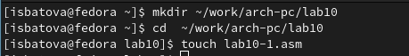{ #fig:001 width=70% }

Открываем файл 'lab10-1.asm' и вводим листинг 10.1 из лабораторной работы (рис. [-@fig:002]).

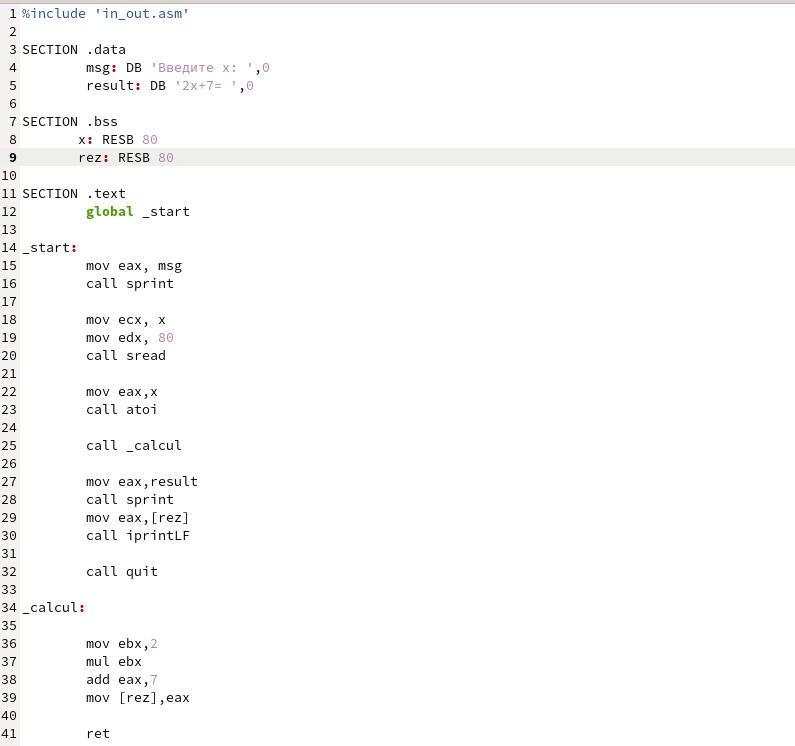{ #fig:002 width=70% }

Создаем исполняемый файл и запускаем его (рис. [-@fig:003]). Программа выводит правильный результат, значит, она написана корректно.

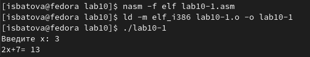{ #fig:003 width=70% }

Далее вновь открываем файл 'lab10-1.asm' и редактируем его, добавляя еще одну подпрограмму (для вычисления сложной функции). (рис. [-@fig:004]).

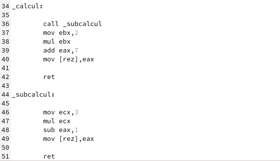{ #fig:004 width=70% }

Создаем исполняемый файл и запускаем его (рис. [-@fig:005]). Программа выводит правильный результат, значит, она написана корректно.

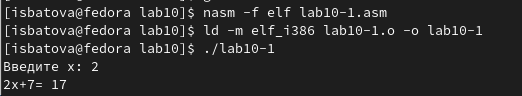{ #fig:005 width=70% }

Для дальнейшей работы создаем файл 'lab10-2.asm' (рис. [-@fig:006]).

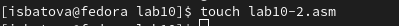{ #fig:006 width=70% }

Открываем этот файл 'lab10-2.asm' и вводим листинг 10.2 из лабораторной работы (рис. [-@fig:007]).

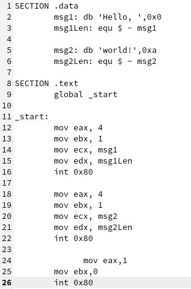{ #fig:007 width=70% }

Создаем исполняемый файл, причем трансляцию выполняем с ключом '-g', чтобы мы могли с этим файлом работать в отладчике (рис. [-@fig:008]).

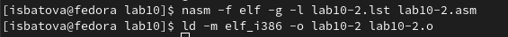{ #fig:008 width=70% }

Загружаем файл в отладчик gdb (рис. [-@fig:009]).

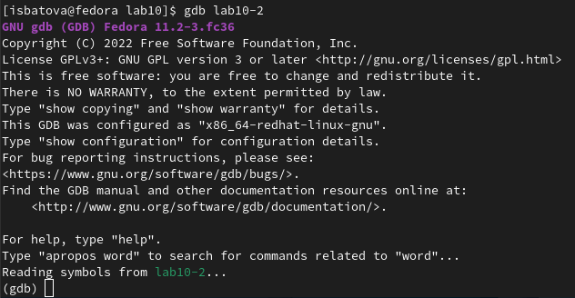{ #fig:009 width=70% }

Для проверки работы программы запускаем ее командой 'run' (рис. [-@fig:0010]). Видим, что программа работает корректно.

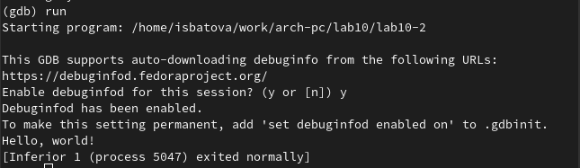{ #fig:0010 width=70% }

Далее устанавливаем брейкпоинт на метку старт и снова запускаем программу (рис. [-@fig:0011]).

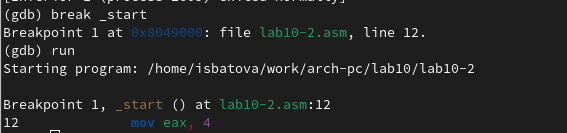{ #fig:0011 width=70% }

После этого вводим команду 'disassemble _start', чтобы посмотреть дисассимилированный код (рис. [-@fig:0012]).

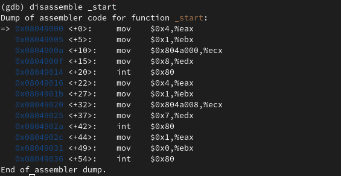{ #fig:0012 width=70% }

Далее мы переключаемся на отображение команд с intel’овским синтаксисом (команда 'set disassembly-flavor intel') и вновь просматриваем дисассимилированный код (рис. [-@fig:0013]).

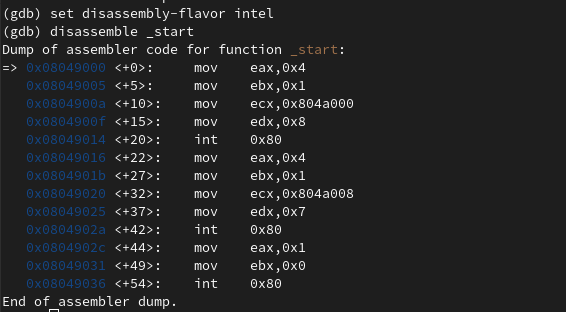{ #fig:0013 width=70% }

Разница между отображениями заключается в удобстве просмотра - в intel'овском синтаксисе отсутствуют знаки '$' и '%', а также идет сначала регистр, а потом его значение. Это делает отображение более наглядным.

После этого вводим команды 'layout asm' и 'layout regs'. Данные команды включают режим псевдографики, что делает анализ программы удобнее (рис. [-@fig:0014]).

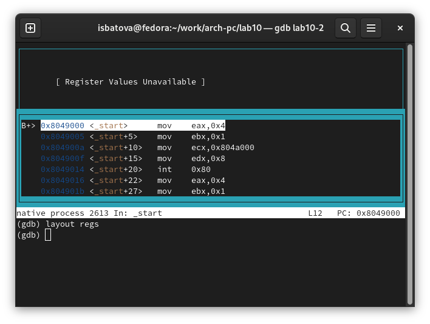{ #fig:0014 width=70% }

Вводим команду 'info breakpoints' для просмотра установленных нами точек останова. Видим одну точку останова, которую мы поставили выше (рис. [-@fig:0015]).

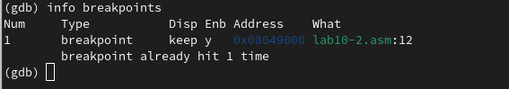{ #fig:0015 width=70% }

После этого нам нужно установить точку останова на предпоследнюю инструкцию. В окне, расположенном посередине, определяем адрес этой инструкции и устанавливаем брейкпоинт по этому адресу. После этого проверяем командой 'info breakpoints' наличие двух точек останова (рис. [-@fig:0016]).

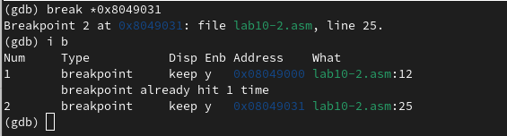{ #fig:0016 width=70% }

На этом моменте у нас данные значения регистров (рис. [-@fig:0017]).

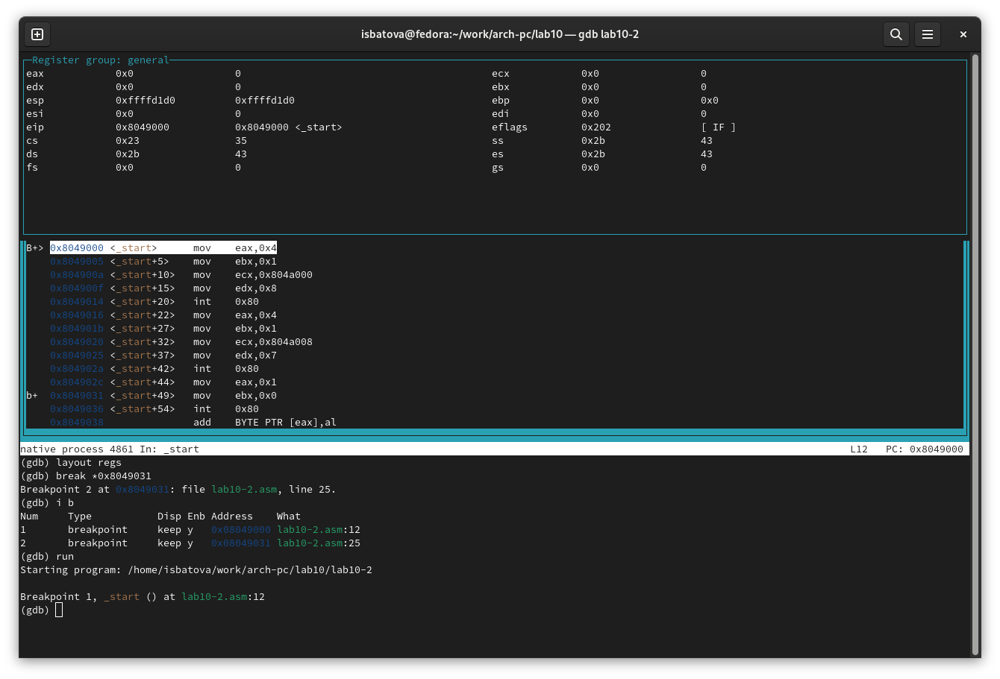{ #fig:0017 width=70% }

Далее вводим команду 'si 5' и видим, что значения регистров eax, edx и eip меняются (рис. [-@fig:0018]).

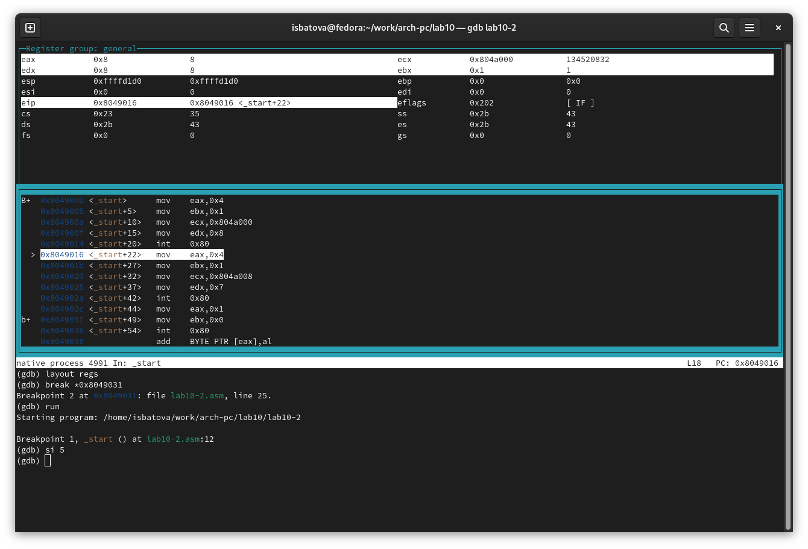{ #fig:0018 width=70% }

Просматриваем значения регистров с помощью команды 'info registers' (рис. [-@fig:0019]).

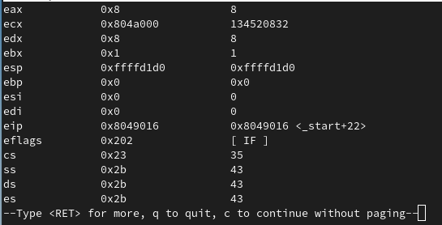{ #fig:0019 width=70% }

Далее мы смотрим содержимое переменной 'msg1' (по имени) (рис. [-@fig:0020]).

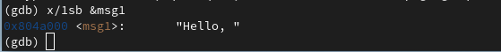{ #fig:0020 width=70% }

После этого с помощью окна посередине определяем адрес переменной 'msg2' и смотрим ее содержимое по адресу (рис. [-@fig:0021]).

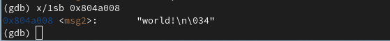{ #fig:0021 width=70% }

Далее исследуем команду изменения содержимого регистров. Вводим "set {char}&msg1='h'". Эта команда заменит нам в регистре msg1 первой символ на h. Проверяем этого, просматривая содержимое регистра (рис. [-@fig:0022]).

{ #fig:0022 width=70% }

Аналогично заменяем первый символ в регистре msg2 на 'L' (команда "set {char}&msg2='L'") и проверяем это (рис. [-@fig:0023]).

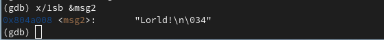{ #fig:0023 width=70% }

Далее мы рассматриваем команду вывода значения регистров. Выводим в трех различных форматах значение регистра edx (рис. [-@fig:0024]).

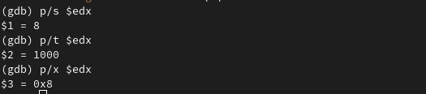{ #fig:0024 width=70% }

После этого мы изменяем значение регистра ebx с помощью команды 'set' (рис. [-@fig:0025]). Мы получаем разные значения, так как во втором случае мы приравниваем регистр к двойке, а в первом вносим значение 2 в регистра.

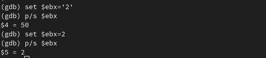{ #fig:0025 width=70% }

Далее мы завершаем работу в отладчике и выходим из него (команда 'quit') (рис. [-@fig:0026]).

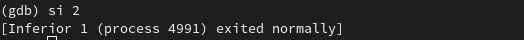{ #fig:0026 width=70% }

Для дальнейшей работы копируем файл 'lab9-2.asm' из девятой лабораторной работы в каталог 'lab10' с именем 'lab10-3.asm' (рис. [-@fig:0027]). 

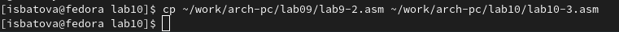{ #fig:0027 width=70% }

Создаем исполняемый файл (трансляцию выполняем с ключом '-g' (рис. [-@fig:0028]).

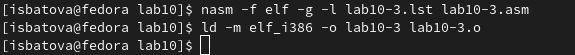{ #fig:0028 width=70% }

После этого запускаем файл в отладчике с указанием аргументов (рис. [-@fig:0029]).

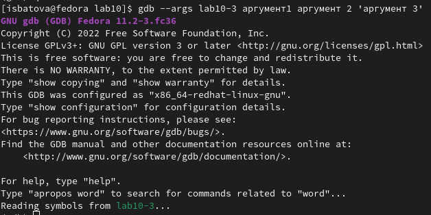{ #fig:0029 width=70% }

Далее устанавливаем брейкпоинт на метку старт и запускаем программу (рис. [-@fig:0030]).

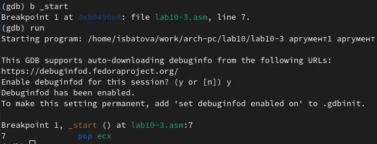{ #fig:0030 width=70% }

Проверяем адрес вершины стека и наличия там 5 позиций (рис. [-@fig:0031]).

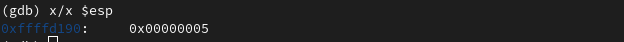{ #fig:0031 width=70% }

После этого просматриваем остальные позиции стека (рис. [-@fig:0032]). Как мы видим, шаг изменения равен четырем. Так происходит потому, что один стек может хранить до четырех байт, и для каждой позиции используется свой стек.

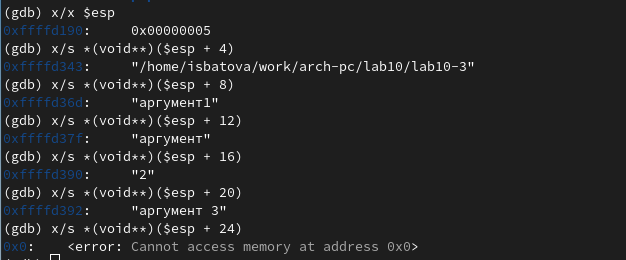{ #fig:0032 width=70% }

# Задание для самостоятельной работы

1. Для выполнения первого задания копируем файл из заданий для самостоятельной работы из лабораторной работы №9 (я копировала с именем 'lab10-4.asm'). Открываем файл и редактируем его так, чтобы вычисление значений у нас было реализовано как подпрограмма (рис. [-@fig:0033]).

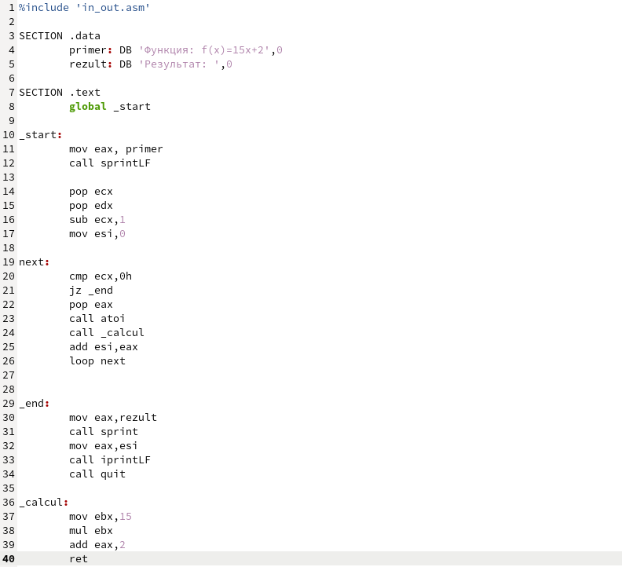{ #fig:0033 width=70% }

Сохраняем изменения, создаем исполняемый файл и запускаем его (рис. [-@fig:0034]). Если посчитать аналитически, получается такой же ответ, поэтому программа работает корректно.

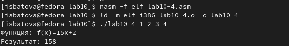{ #fig:0034 width=70% }

2. Для начала выполнения второго задания создаем файл 'lab10-5.asm' и вводим в него листинг 10.3 - вычисление выражения (3+2)*4+5 (рис. [-@fig:0035]).

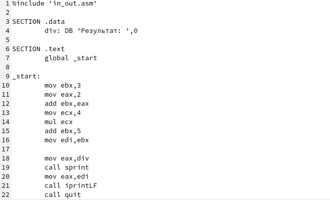{ #fig:0035 width=70% }

Cоздаем исполняемый файл и запускаем его (рис. [-@fig:0036]). Если посчитать аналитически, ответ должен быть 25, а программа выдает 10.

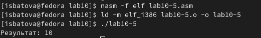{ #fig:0036 width=70% }

Для поиска ошибки создаем исполняемый файл с ключом '-g' и загружаем файл в отладчик (рис. [-@fig:0037]).

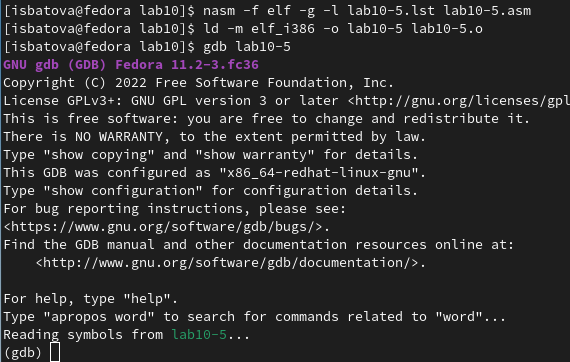{ #fig:0037 width=70% }

Устанавливаем точку останова на метку start (рис. [-@fig:0038]) и дисассемилируем код (с intel'овским изображением (рис. [-@fig:0039]).

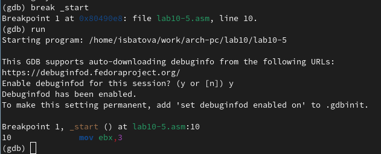{ #fig:0038 width=70% }

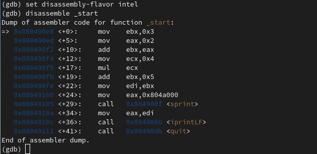{ #fig:0039 width=70% }

Открываем режим псевдографики. Далее, с помощью команды 'si', выполняем программу по одному шагу и на каждом смотрим значения регистров eax и ebx. Путем анализа понимаем, что на 5 шаге у нас на регистр ecx (то есть на 4) умножается не ebx, а eax, поэтому программа и выводит неверный результат. Чтобы исправить это, мы после прибавления к регистру ebx регистра eax записываем получившееся значение в eax. Далее у нас eax умножается на 4, после чего мы обратно записываем значение регистра eax в регистр ebx (рис. [-@fig:0041]).

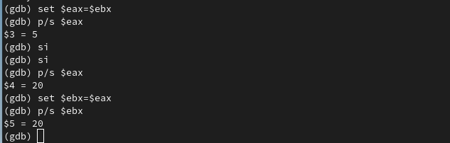{ #fig:0041 width=70% }

Далее вводим команду 'continue', чтобы наша программа была выполнена до конца и получаем верный результат (рис. [-@fig:0042]).

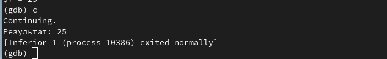{ #fig:0042 width=70% }

# Выводы

В данной лабораторной работе мной были приобретены навыки написания программ с использованием подпрограмм, а также навыки работы с методами отладки при помощи GDB.

