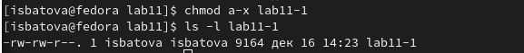

---
## Front matter
title: "Отчёт по лабораторной работе №11"
subtitle: "Дисциплина: Архитектура компьютера"
author: "Батова Ирина Сергеевна, НММбд-01-22"

## Generic otions
lang: ru-RU
toc-title: "Содержание"

## Bibliography
bibliography: bib/cite.bib
csl: pandoc/csl/gost-r-7-0-5-2008-numeric.csl

## Pdf output format
toc: true # Table of contents
toc-depth: 2
lof: true # List of figures
lot: true # List of tables
fontsize: 12pt
linestretch: 1.5
papersize: a4
documentclass: scrreprt
## I18n polyglossia
polyglossia-lang:
  name: russian
  options:
	- spelling=modern
	- babelshorthands=true
polyglossia-otherlangs:
  name: english
## I18n babel
babel-lang: russian
babel-otherlangs: english
## Fonts
mainfont: PT Serif
romanfont: PT Serif
sansfont: PT Sans
monofont: PT Mono
mainfontoptions: Ligatures=TeX
romanfontoptions: Ligatures=TeX
sansfontoptions: Ligatures=TeX,Scale=MatchLowercase
monofontoptions: Scale=MatchLowercase,Scale=0.9
## Biblatex
biblatex: true
biblio-style: "gost-numeric"
biblatexoptions:
  - parentracker=true
  - backend=biber
  - hyperref=auto
  - language=auto
  - autolang=other*
  - citestyle=gost-numeric
## Pandoc-crossref LaTeX customization
figureTitle: "Рис."
tableTitle: "Таблица"
listingTitle: "Листинг"
lofTitle: "Список иллюстраций"
lotTitle: "Список таблиц"
lolTitle: "Листинги"
## Misc options
indent: true
header-includes:
  - \usepackage{indentfirst}
  - \usepackage{float} # keep figures where there are in the text
  - \floatplacement{figure}{H} # keep figures where there are in the text
---

# Цель работы

Приобретение навыков написания программ для работы с файлами.

# Выполнение лабораторной работы

1. Сначала создаем каталог 'lab11' с помощью команды mkdir, переходим в него с помощью команды cd и создаем в нем файлы 'lab11-1.asm' и 'readme.txt' с помощью команды touch (рис. [-@fig:001]).

{ #fig:001 width=70% }

2. Открываем файл 'lab11-1.asm' и вводим в него текст из листинга 11.1 (рис. [-@fig:002]).

{ #fig:002 width=70% }

Создаем исполняемый файл и запускаем его. Проверяем командой cat, что программа была выполнена корректно (рис. [-@fig:003]). 

{ #fig:003 width=70% }

Далее с помощью команды ls с ключом -l смотрим, какие файлы у нас есть и какой доступ к ним мы имеем (рис. [-@fig:004]). 

{ #fig:004 width=70% }

3. Далее нам нужно запретить выполнение файла 'lab11-1'. Для этого вводим команду 'chmod a-x' и с помощью команды 'ls -l' проверяем корректность выполнения (рис. [-@fig:005]). 

{ #fig:005 width=70% }

Запускаем этот исполняемый файл, но так как мы запретили его выполнение, программа выводит сообщение "Отказано в доступе" (рис. [-@fig:006]). 

{ #fig:006 width=70% }

4. С помощью команды 'chmod a+x' добавляем права на выполнение файла 'lab11-1.asm', командой 'ls -l' проверяем корректность выполнения (рис. [-@fig:007]). 

{ #fig:007 width=70% }

Запускаем этот  файл (рис. [-@fig:008]). Программа выводит последовательность строк, в которых написано, что команда не найдена или нет управления заданиями. Так происходит, поскольку это не исполняемый файл.

{ #fig:008 width=70% }

5. По варианту 11 мне нужно сначала предоставить файлу 'readme.txt' следующие права: --x r-- -w-. Это означает, что владельцу предоставляются только права на исполнение, группе - только на чтение, остальным - только на запись. Для этого вводим 'chmod 142' (восьмеричный способ записи) и командой 'ls -l' проверяем корректность выполнения(рис. [-@fig:009]). 

{ #fig:009 width=70% }

Далее нужно предоставить этому же файлу следующие права: 000 100 111, то есть владельцу не предоставляются никакие права, группе только на чтение, а остальным и на чтение, и на запись, и на исполнение. Для этого вводим команду 'chmod 047' и командой 'ls -l' проверяем корректность выполнения (рис. [-@fig:0010]). 

{ #fig:0010 width=70% }

# Задание для самостоятельной работы

1. Нам нужно написать программу, которая выводит вопрос "Как вас зовут?", считывает введенное с клавиатуры имя и создает файл, в которое вписывает фразу "Меня зовут" и введенное с клавиатуры имя, а после закрывает файл. Создаем файл 'lab11-2.asm' и вводим в него данную программу (рис. [-@fig:0011], [-@fig:0012]). 

{ #fig:0011 width=70% }

{ #fig:0012 width=70% }

Создаем исполняемый файл и запускаем его. Проверяем командой ls -l, что файл был создан, а командой cat, что в файл была записана необходимая информация (рис. [-@fig:0013]).

{ #fig:0013 width=70% }

# Выводы

В данной лабораторной работе мной были приобретены навыки написания программ для работы с файлами.

